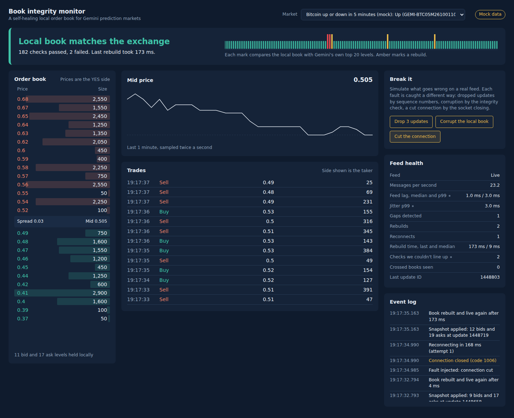
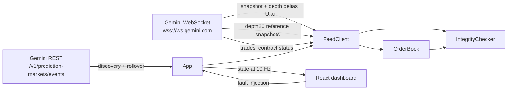

# Book integrity monitor

A local order book for Gemini prediction markets that proves it's correct, notices when it isn't, and rebuilds itself.

It streams Gemini's public market data over WebSocket, maintains an L2 order book from a snapshot plus sequenced deltas, and continuously checks that book against the exchange's own published top-of-book. A fault-injection panel lets you break it three different ways and watch each failure get caught by a different mechanism.



*Screenshot from mock mode. The red marks on the strip are the integrity check catching a silently corrupted book; the amber marks are rebuilds.*

## Why

A local order book is only useful if it's exactly right. The failure modes that matter are quiet ones: a dropped message leaves a stale price level behind, a bug corrupts a size, a connection dies without closing. The book keeps rendering, it's just wrong. This project treats correctness as something to measure continuously, not assume.

## How it works



**Sequencing.** The connection opens with `snapshot=-1`, so the first `depthUpdate` after subscribing carries the full book. Every later frame covers update IDs `U..u`. If a frame's `U` skips past the last applied `u`, updates were lost and the book is discarded. Frames entirely at or below the last applied ID are ignored as stale; partial overlaps are safe to apply because setting a level's size is idempotent.

**Resync on a fresh connection.** Recovery opens a new socket rather than unsubscribing and resubscribing. That costs a handshake (tens of milliseconds), but it guarantees no frame from the old subscription can arrive after the reset, so the first depth frame is unambiguously the new snapshot.

**Integrity check.** The client also subscribes to `{symbol}@depth20@100ms`, Gemini's periodic top-20 snapshot. A comparison only counts when the reference's `lastUpdateId` equals the local book's last applied ID, so both describe the same instant. References that are ahead are held until the book catches up; ones that can't be lined up exactly are counted as skipped, never as passes. Two consecutive mismatches trigger a rebuild.

**Prices as strings.** Prices and sizes stay as decimal strings, canonicalized so `"0.480"` and `"0.48"` are the same level. An L2 feed replaces sizes rather than adding to them, so no floating-point arithmetic ever touches book state.

| Failure | How it's detected | Response |
|---|---|---|
| Dropped updates | Sequence gap (`U > last u + 1`) | Discard book, rebuild on a fresh connection |
| Silent corruption | Local top 20 differs from the exchange's at the same update ID | Rebuild after two consecutive mismatches |
| Connection drop | Socket close | Reconnect with exponential backoff and jitter |
| Dead connection | No data for 30 s despite heartbeat pings | Rebuild |
| Rebuild loop | Three rebuilds in 10 s | Back off for 2 s |
| Contract expires | `contractStatus` stream, or contract delisted from REST | Roll over to the next contract in the same series |

**Latency.** Feed lag is the exchange's event timestamp (nanoseconds) subtracted from local arrival time, so it includes any clock offset between this machine and Gemini's. Jitter (p99 lag minus the minimum observed lag) cancels a constant offset and is the more trustworthy number. Measured from a laptop over the public internet, these reflect the network more than the code.

## Run it

Requires Node 18+. No API key; every stream used here is public.

```bash
npm install
npm run dev        # live Gemini data
npm run dev:mock   # offline, synthetic data from the local mock exchange
```

Open http://localhost:5173.

To watch one fixed symbol instead of auto-discovering: `SYMBOL=<instrumentSymbol> npm run dev`.

Production build: `npm run build && npm start` serves the dashboard and API from http://localhost:8787.

## Tests

```bash
npm test
```

30 tests. The unit tests cover the book (sequencing, stale and overlapping frames, level removal, decimal canonicalization, crossed-book detection), the integrity checker, and market discovery and rollover. The end-to-end tests run the real `FeedClient` over real sockets against a mock exchange that speaks the same protocol and holds the true book, then assert the client's book is identical after each fault: dropped updates, an exchange-side gap, silent corruption, a cut connection, the exchange dropping every client, and a symbol switch.

## Layout

```
server/src/
  orderbook.ts     book state and sequencing
  integrity.ts     comparison against exchange reference snapshots
  feed.ts          connection, recovery, heartbeat, fault injection
  markets.ts       discovery and next-contract selection
  app.ts           wiring, rollover, dashboard state
  http.ts          API and state stream
  mock/exchange.ts protocol-compatible mock for tests and offline demos
web/src/           React dashboard
test/              unit and end-to-end tests
scripts/           discover.ts and record.ts for capturing live frames
```

## Built against the docs, verified offline

The mock exchange implements the protocol as documented. These points are worth confirming against live traffic, and the code degrades visibly rather than silently if any are off:

- That the `depth20` reference stream's `lastUpdateId` shares a sequence with the differential stream's `u`. If not, checks show up as skipped rather than passed.
- Contract status strings for ended contracts. Rollover also falls back to the REST listing.
- The exact shape of the events response. Discovery walks the JSON for `instrumentSymbol` rather than assuming a schema.

## Next

- Replay recorded live sessions (`npm run record`) as regression fixtures.
- Measure clock offset with the WebSocket `time` method instead of the minimum-lag estimate.
- Track several contracts per connection, with per-symbol sequencing.
- Export metrics to Prometheus.
