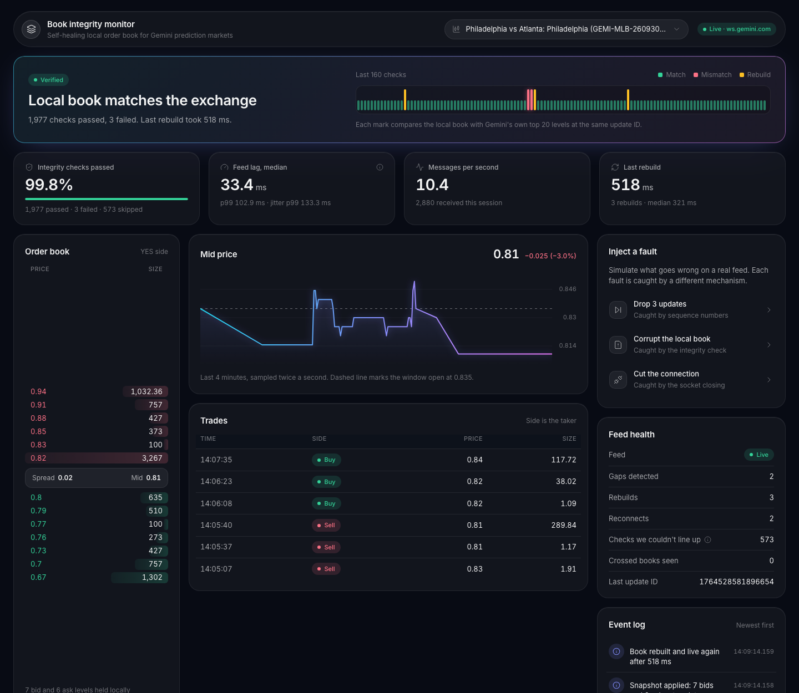
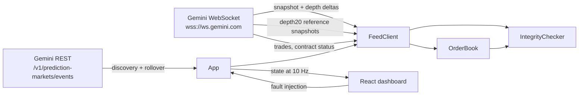

# Book integrity monitor

A local order book for Gemini prediction markets that proves it's correct, notices when it isn't, and rebuilds itself.

It streams Gemini's public market data over WebSocket, maintains an L2 order book from a snapshot plus sequenced deltas, and continuously checks that book against the exchange's own published top-of-book. A fault-injection panel lets you break it three different ways and watch each failure get caught by a different mechanism.



*Live data from a Gemini prediction market. The red marks on the integrity strip are the check catching a silently corrupted book; the amber marks are rebuilds.*

## Why

A local order book is only useful if it's exactly right. The failure modes that matter are quiet ones: a dropped message leaves a stale price level behind, a bug corrupts a size, a connection dies without closing. The book keeps rendering, it's just wrong. This project treats correctness as something to measure continuously, not assume.

## How it works



**Sequencing.** The connection opens with `snapshot=-1`, so the first `depthUpdate` after subscribing carries the full book, and its `u` is the last applied ID. On the live feed, each later frame's `U` equals the previous frame's `u`: a frame covers the IDs after `U` through `u`. So if a frame's `U` is past the last applied `u`, a frame was lost and the book is discarded. Frames entirely at or below the last applied ID are ignored as stale; overlaps are safe to apply because setting a level's size is idempotent. Update IDs are shared across every market on the exchange, so the size of a gap says nothing about how many of this book's updates were lost.

**Resync on a fresh connection.** Recovery opens a new socket rather than unsubscribing and resubscribing. That costs a handshake (tens of milliseconds), but it guarantees no frame from the old subscription can arrive after the reset, so the first depth frame is unambiguously the new snapshot.

**Integrity check.** The client also subscribes to `{symbol}@depth20@100ms`, Gemini's periodic top-20 snapshot. A comparison only counts when the reference's `lastUpdateId` equals the local book's last applied ID, so both describe the same instant. References that are ahead are held until the book catches up; ones that can't be lined up exactly are counted as skipped, never as passes. Two consecutive mismatches trigger a rebuild.

**Healed mismatches.** On a busy book, the level that went wrong often changes again within a fraction of a second. The exchange's next update overwrites the bad value, and the following check passes before a second one can fail. The book is correct again, so no rebuild happens, but the dashboard doesn't file this as an ordinary pass. It's reported separately as healed, because a book that keeps drifting and healing points to a real bug.

**Prices as strings.** Prices and sizes stay as decimal strings, canonicalized so `"0.480"` and `"0.48"` are the same level. An L2 feed replaces sizes rather than adding to them, so no floating-point arithmetic ever touches book state.

| Failure | How it's detected | Response |
|---|---|---|
| Dropped updates | Sequence gap (`U > last u`) | Discard book, rebuild on a fresh connection |
| Silent corruption | Local top 20 differs from the exchange's at the same update ID | Rebuild after two consecutive mismatches, or report it as healed if a later update corrects the book first |
| Connection drop | Socket close | Reconnect with exponential backoff and jitter |
| Dead connection | No data for 30 s despite heartbeat pings | Rebuild |
| Rebuild loop | Three rebuilds in 10 s | Back off for 2 s |
| Contract expires | `contractStatus` stream, or contract delisted from REST | Roll over to the next contract in the same series |

**Latency.** Feed lag is the exchange's event timestamp (nanoseconds) subtracted from local arrival time, sampled on deltas only. The snapshot is excluded because its timestamp is when the book last changed, which on a quiet market can be minutes old. Lag includes any clock offset between this machine and Gemini's; a clock that runs slightly fast even produces negative values. Jitter (p99 lag minus the minimum observed lag) cancels a constant offset and is the more trustworthy number. The dashboard holds these back until 20 deltas have arrived. Measured from a laptop over the public internet, they reflect the network more than the code.

**Discovery.** With no `SYMBOL` set, the app reads the first page of active events and starts on the busiest contract: live events first, then by 24-hour volume. When a contract ends, it rolls over to the next one in the same series.

## Run it

Requires Node 18+. No API key; every stream used here is public.

```bash
npm install
npm run dev        # live Gemini data
npm run dev:mock   # offline, synthetic data from the local mock exchange
```

Open http://localhost:5173.

To watch one fixed symbol instead of auto-discovering: `SYMBOL=<instrumentSymbol> npm run dev`.

Production build: `npm run build && npm start` serves the dashboard and API from http://localhost:8787.

## The dashboard

- **Integrity strip** (top): one mark per check. Green is a pass, red a mismatch, amber a rebuild, and indigo a mismatch that healed on its own (below).
- **Key metrics**: integrity pass rate, feed lag, messages per second, and the last rebuild time.
- **Order book** (left): the local book's top levels. **Mid price** and **Trades** (center).
- **Inject a fault** (right), with **Feed health** counters and the **Event log**, which narrates each detection and recovery.

For a demo, pick a busy contract: on a quiet market no deltas arrive, so *Drop 3 updates* waits until real ones do. *Corrupt the local book* and *Cut the connection* work on any market.

## Tests

```bash
npm test
```

40 tests. The unit tests cover the book (sequencing, stale and overlapping frames, level removal, decimal canonicalization, crossed-book detection), the integrity checker, and market discovery and rollover. The end-to-end tests run the real `FeedClient` over real sockets against a mock exchange that speaks the same protocol and holds the true book, then assert the client's book is identical after each fault: dropped updates, an exchange-side gap, silent corruption, a cut connection, the exchange dropping every client, and a symbol switch. The mock also has a quiet mode, as on a live market with no activity: the book stops changing but `depth20` snapshots keep arriving, which covers lag sampling, the stale-data watchdog, and faults on a quiet book.

## Layout

```
server/src/
  orderbook.ts     book state and sequencing
  integrity.ts     comparison against exchange reference snapshots
  feed.ts          connection, recovery, heartbeat, fault injection
  markets.ts       discovery and next-contract selection
  app.ts           wiring, rollover, dashboard state
  http.ts          API and state stream
  mock/exchange.ts protocol-compatible mock for tests and offline demos
web/src/           React dashboard
test/              unit and end-to-end tests
scripts/           discover.ts and record.ts for capturing live frames
```

## Verified on live data

The mock was first written from the docs. Running against live Gemini traffic confirmed or corrected each assumption:

- **`depth20` lines up with the diff stream.** Its `lastUpdateId` shares a sequence with the deltas' `u`. On an in-progress MLB game, the checks that could be lined up passed every time except when a fault was injected. The share that couldn't be lined up, and so was skipped rather than passed, varied from under 1% in one session to about 22% in another.
- **Frame numbering.** Each frame's `U` equals the previous frame's `u`, not `u + 1` (20 of 20 consecutive frames across five contracts). The gap check originally assumed `u + 1`, which could miss a lost frame spanning two IDs or fewer.
- **IDs are exchange-wide.** Two contracts' frames ended on consecutive IDs, so dropping three frames showed up as a 1,389-ID gap.
- **Quiet books.** `depth20@100ms` arrives every 100 ms even when nothing changes, and the snapshot's `E` is the time of the last change. Sampling that snapshot once made a quiet market report 132.9 s of lag.
- **All three faults recover on live data**, with rebuilds of about 300 to 500 ms.

Still unconfirmed: the contract status strings sent when a contract ends. Rollover also falls back to the REST listing.

## Roadmap

The order book monitor is the foundation. Next up, each with a design doc before any code:

1. **Many books over shared connections**: the foundation for everything below ([design 0001](docs/design/0001-multi-contract-feed.md)).
2. **Market coherence monitor**: how tightly related contracts respect the rules of probability, and how fast breaks are corrected ([finding 0001](docs/findings/0001-market-coherence.md)).
3. **Implied price distributions** from crypto strike ladders.
4. **Market health scoreboard** across every live contract.
5. **Liquidity rewards estimator** from public pool data.

Smaller items: measure clock offset with the WebSocket `time` method instead of the minimum-lag estimate, and export metrics to Prometheus.

Design docs live in [`docs/design`](docs/design), and measurements of live market behavior in [`docs/findings`](docs/findings).

## License

MIT. An independent project that uses Gemini's public market data; not affiliated with or endorsed by Gemini.
